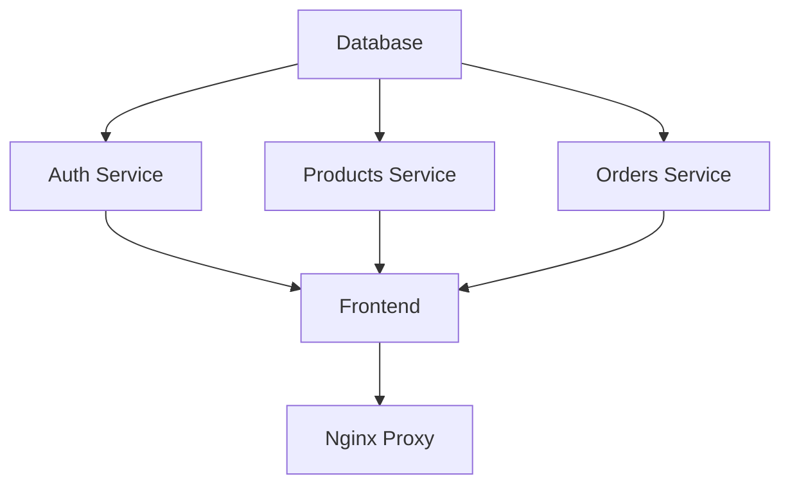

# 🐳 Docker Setup Guide - Four Leaf Clover Jewelry Shop

This guide will help you build and run the complete Four Leaf Clover Jewelry Shop using Docker containers.

## 📋 Prerequisites

### Required Software
- **Docker** (20.10+) - [Download Docker](https://docs.docker.com/get-docker/)
- **Docker Compose** (2.0+) - Usually included with Docker Desktop
- **Git** - For cloning the repository

### System Requirements
- **RAM**: Minimum 4GB, Recommended 8GB+
- **Storage**: At least 2GB free space for Docker images
- **CPU**: 2+ cores recommended

### Verify Installation
```bash
# Check Docker version
docker --version
docker-compose --version

# Test Docker is running
docker run hello-world
```

## 🚀 Quick Start (One Command Setup)

```bash
# Clone, build, and run everything
git clone <your-repo-url>
cd four-leaf-clover-jewelry-shop
docker-compose up --build
```

After running this command, wait for all services to start (2-3 minutes), then:
- 🌐 **Visit**: http://localhost:3000 (Frontend)
- 🔧 **Admin**: http://localhost:3000/admin
- 📊 **Direct Access**: Services on ports 3001, 3002, 3003

## 📁 Project Structure

```
four-leaf-clover-jewelry-shop/
├── docker-compose.yml          # Main orchestration file
├── database/
│   ├── schema.sql              # Database structure
│   └── sample-data.sql         # Sample products & users
├── backend/
│   ├── auth-service/
│   │   ├── Dockerfile
│   │   └── src/
│   ├── products-service/
│   │   ├── Dockerfile
│   │   └── src/
│   └── orders-service/
│       ├── Dockerfile
│       └── src/
├── frontend/
│   ├── Dockerfile
│   └── src/
└── docker/
    └── nginx/
        ├── nginx.conf
        └── default.conf
```

## 🛠️ Step-by-Step Setup

### 1. Build All Images
```bash
# Build all Docker images
docker-compose build

# Or build with no cache (if you have issues)
docker-compose build --no-cache
```

### 2. Start Services
```bash
# Start all services
docker-compose up

# Or run in background (detached mode)
docker-compose up -d

# View logs
docker-compose logs -f
```

### 3. Verify Services
```bash
# Check running containers
docker-compose ps

# Test health endpoints
curl http://localhost:3001/health  # Auth service
curl http://localhost:3002/health  # Products service  
curl http://localhost:3003/health  # Orders service
curl http://localhost:3000         # Frontend
```

## 🔧 Service Configuration

### Environment Variables
All services are pre-configured with production-ready environment variables:

**Database:**
- Host: `database`
- Port: `5432`
- Database: `four_leaf_clover_shop`
- User: `postgres`
- Password: `clover_password_2024`

**JWT Secret:**
- Secret: `clover-super-secret-jwt-key-for-production-2024`

**Ports:**
- Frontend: `3000`
- Auth Service: `3001`
- Products Service: `3002`
- Orders Service: `3003`
- PostgreSQL: `5432`
- Nginx (Optional): `80`

### Service Dependencies


## 📊 Default Admin Access

The Docker setup creates a default admin user:

**Admin Credentials:**
- Email: `admin@fourleafclover.com`
- Password: `admin123456`

**Customer Test Accounts:**
- Email: `sarah.johnson@email.com` | Password: `password123`
- Email: `mike.chen@email.com` | Password: `password123`
- Email: `emma.wilson@email.com` | Password: `password123`

## 🗄️ Database Information

### Automatic Setup
- Database schema is automatically created on first run
- Sample data is populated including:
  - 10 sample jewelry products
  - 6 product categories  
  - Sample orders and reviews
  - Test users and addresses

### Manual Database Access
```bash
# Connect to PostgreSQL container
docker-compose exec database psql -U postgres -d four_leaf_clover_shop

# View tables
\dt

# View sample products
SELECT id, name, price FROM products;

# Exit
\q
```

## 🔄 Common Operations

### Restart Services
```bash
# Restart all services
docker-compose restart

# Restart specific service
docker-compose restart frontend
docker-compose restart auth-service
```

### Update Code & Rebuild
```bash
# Stop services
docker-compose down

# Rebuild with latest code
docker-compose build

# Start again
docker-compose up
```

### View Logs
```bash
# All services
docker-compose logs

# Specific service with follow
docker-compose logs -f frontend
docker-compose logs -f auth-service

# Last 50 lines
docker-compose logs --tail=50
```

### Scale Services (if needed)
```bash
# Scale backend services
docker-compose up --scale auth-service=2 --scale products-service=2
```

## 🛑 Stop & Cleanup

### Stop Services
```bash
# Stop all services (containers remain)
docker-compose stop

# Stop and remove containers
docker-compose down

# Stop and remove containers + volumes (deletes database data)
docker-compose down -v
```

### Clean Up Resources
```bash
# Remove unused Docker resources
docker system prune

# Remove all related images
docker-compose down --rmi all

# Remove everything including volumes
docker-compose down -v --rmi all --remove-orphans
```

## 🐛 Troubleshooting

### Common Issues

**1. Port Already in Use**
```bash
# Check what's using the port
lsof -i :3000

# Kill the process
kill -9 <PID>

# Or change ports in docker-compose.yml
```

**2. Database Connection Failed**
```bash
# Check database container status
docker-compose ps database

# Check database logs
docker-compose logs database

# Restart database
docker-compose restart database
```

**3. Build Failures**
```bash
# Clean build
docker-compose build --no-cache

# Check available disk space
docker system df

# Remove unused images
docker image prune
```

**4. Frontend Not Loading**
```bash
# Check frontend logs
docker-compose logs frontend

# Verify environment variables
docker-compose exec frontend env | grep NEXT_PUBLIC
```

**5. Service Health Check Fails**
```bash
# Check service logs
docker-compose logs auth-service

# Test manually
docker-compose exec auth-service curl http://localhost:3001/health
```

### Performance Issues

**Slow Startup:**
- Increase Docker resource limits (Memory/CPU)
- Use SSD storage for Docker volumes
- Close other resource-intensive applications

**Database Slow:**
```bash
# Check database resource usage
docker stats clover-database

# Optimize PostgreSQL if needed (increase shared_buffers, etc.)
```

## 🔧 Development Mode

For development with hot reload:

```bash
# Create development override
cat > docker-compose.override.yml << EOF
version: '3.8'
services:
  frontend:
    command: npm run dev
    volumes:
      - ./frontend:/app
      - /app/node_modules
    environment:
      - NODE_ENV=development
  
  auth-service:
    command: npm run dev
    volumes:
      - ./backend/auth-service:/app
      - /app/node_modules
      
  # ... similar for other services
EOF

# Run in development mode
docker-compose up
```

## 📦 Production Deployment

### Environment Variables
Create `.env` file for production:
```env
# Security
JWT_SECRET=your-super-secure-jwt-secret-here
DB_PASSWORD=your-secure-database-password

# Domain
DOMAIN=yourstore.com
NEXT_PUBLIC_AUTH_SERVICE_URL=https://yourstore.com/api/auth
NEXT_PUBLIC_PRODUCTS_SERVICE_URL=https://yourstore.com/api/products
NEXT_PUBLIC_ORDERS_SERVICE_URL=https://yourstore.com/api/orders
```

### SSL/HTTPS Setup
```yaml
# Add to docker-compose.yml for production
services:
  nginx:
    ports:
      - "443:443"
    volumes:
      - ./ssl:/etc/nginx/ssl:ro
      - ./docker/nginx/nginx-ssl.conf:/etc/nginx/nginx.conf:ro
```

### Resource Limits
```yaml
# Add resource limits in production
services:
  frontend:
    deploy:
      resources:
        limits:
          memory: 512M
        reservations:
          memory: 256M
```

## 📈 Monitoring

### Container Health
```bash
# Check all container health
docker-compose ps

# Monitor resource usage
docker stats

# View system info
docker system info
```

### Application Logs
```bash
# Application logs
docker-compose logs --tail=100 -f

# Error logs only
docker-compose logs | grep -i error

# Export logs
docker-compose logs > app-logs.txt
```

## 🔄 Backup & Recovery

### Database Backup
```bash
# Create backup
docker-compose exec database pg_dump -U postgres four_leaf_clover_shop > backup.sql

# Restore backup
docker-compose exec -T database psql -U postgres -d four_leaf_clover_shop < backup.sql
```

### Volume Backup
```bash
# Backup volumes
docker run --rm -v clover_postgres_data:/source -v $(pwd):/backup alpine tar czf /backup/db-backup.tar.gz -C /source .

# Restore volumes
docker run --rm -v clover_postgres_data:/target -v $(pwd):/backup alpine tar xzf /backup/db-backup.tar.gz -C /target
```

## 🎯 Testing the Setup

### Automated Tests
```bash
# Run a complete test suite
./scripts/test-docker-setup.sh
```

### Manual Testing Checklist
- [ ] Frontend loads at http://localhost:3000
- [ ] Admin dashboard accessible at /admin
- [ ] Can register new user account
- [ ] Can login with admin credentials
- [ ] Products display with images
- [ ] Can add products to cart
- [ ] Admin can manage inventory
- [ ] Database persists data after restart

## 📞 Support

If you encounter issues:

1. **Check logs**: `docker-compose logs <service-name>`
2. **Verify ports**: `docker-compose ps`
3. **Test health**: `curl http://localhost:3001/health`
4. **Restart services**: `docker-compose restart`
5. **Clean rebuild**: `docker-compose down && docker-compose build --no-cache && docker-compose up`

---

**🍀 Your Four Leaf Clover Jewelry Shop is ready to bring luck and style to your customers!** 